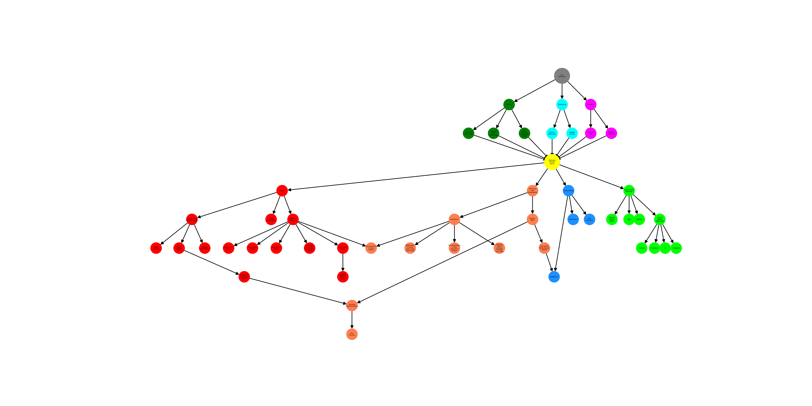

## What Problem Are we solving 

Climate change is an environmental and societal emergency, where urgent action across all sectors is required. misinformation about climate change continues to hinder necessary action. 

This misinformation is commonly spread online, and therefore can reach many individuals rapidly. Online misinformation in particular is pervasive, as it can spread significantly faster than it can be countered by experts.

An increasing reliance on social media platforms to source news and the rapid prevalence of AI in our modern world  has created a reality in which traditional means of fact-checking and countering misleading information cannot keep up. 
 
## A web extension as a solution to Climate Change Misinformation

Our current answer to this problem is a web extention that will be able to detect and debunk climate change misinformation.

The way that this would work is someone would have the extension installed on their computer, and when they find a piece of misinformation on the internet, the extention will be able to tell the user what the misinformation is and why it is misleading. Providing this debunking content at the same time or even before the misinformation is read has been proven to be more effective than trying to provide debunking information after people have been exposed to misinformatoin. 

## Who would use Climate Genie

Most people get their news from the internet, therefore making the potential install base extremely large. We have intentionally made the barrier to entry extremely low, and the impact on the browsing experience is minimal in most cases. This should allow maximal uptake amongst people who are even the slightest bit concerned about climate change misinformation.

## What Climate Genie can Do

Currently, the Climate Genie extension works on most News Sites and Blogs. It can detect over [80 common pieces](https://i0.wp.com/cardsclimate.com/wp-content/uploads/2021/10/header_taxonomy.png?fit=1920%2C800&ssl=1) of climate change misinformation and provide debunking infromation and resouces specifc to each of these claims. 

In parallel to this, the extension functions as a data gathering tool to see what type of misinformation is being read and where, allowing us to map the landscape of online climate change misinformation and better combat it in the future. 

## Where we can take it in the Future

After releasing the extension, there are various driections in which we can take it. This has been summariesd in the diagram below.

### Improving Our Modeling

Although our AI model for detecting climate change misinformation is pretty good right now, we still have room to improve it. The ways we can do this are:

 - Increasing the amount of training data or compute power we have for it to improve the performance
 - Increasing the number of common climate denialist arguments that it can detect
 - Remaking the model in different languages to work on a global scale

### Research and Publications

As part of the ongoing development of the extension and its ability to collect data on its user's habits, there various possibilities when looking at research projects and reports.

#### Academic Work
The research backed nature of the extension provides numerous opportunities to perform academic research. Some ideas for this include:

 - Formal Deconstruction of New Claims
 - A Recreation of the work in Coan 2021 with the improved model
 - Investigating behaviour change with the use of the extension
 - A write up of the extension itself

#### Report Style Publications

Less formal publications are also possible. A major avenue of this is using the extension and the data it gathers to step into the space of more traditional fact checking. Ideas for this kind of writing include:

 - See what misinformation is trending, and potentially provide pre-bunking material 
 - Misinformation produced by each News Outlet
 - Breakdown of misinformation surrounding a hot topic

### Deployment Methods

Currently, we provide debunking content through the medium of a web extension. However, there are other methods through which it may be useful, such as:

 - A chatbot
 - Integration with social media (Facebook, X, etc. )
 - App
 - Website

### Future Partnerships

The final prospect for expanding the work of the climate genie project is looking into partnering with other organisations who could utilise our resources.

#### Educational Institutions

The research that climate genie is based on utilises a systematic method for detecting, breaking down and countering misinformation. Although we have used this work and applied the steps in our extension, it is easy enough to convert it into resources for educators across a range of levels. We already have interest from the Monash School of Media, Film and Journalism, as well as possible connections through the  hubs climate classrooms project.

#### Fact Checking Institutions

The first part of any fact checking effort is finding misinformation, something that our model and extension are very good at. We could possibly give fact checking organisations the ability to get ahead of the curb when it comes to new misinformation being spread.

#### Media Distributors and Writers 

Often, misinformation is spread by well meaning people who don’t know any better. Working with publishers, distributors and writers could allow us to help stop the spread of misinformation by stopping it before it gets out into the wold.

